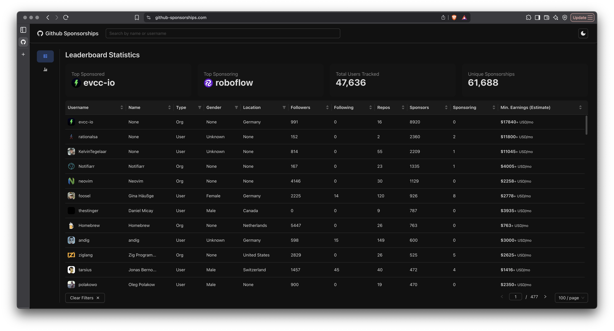

# ICSE-2026: Tool Documentation: A Priority-Based Traversal Tool for GitHub Sponsorship Data



<p align="center">
  <a href="https://youtu.be/Wr2YlItWXvM" style="text-decoration: none; border: none;">
    
  </a>
  <a href="https://github-sponsorships.com/" style="text-decoration: none; border: none;">
    
  </a>
</p>


## 1. Overview

This document provides technical documentation for the backend component of the tool presented in the paper, "A Priority-Based Traversal Tool for Longitudinal Collection & Analysis of GitHub Sponsorship Data."

The core of this tool is the `IngestWorker`, a continuous, long-running process designed to build and maintain a longitudinal dataset of the GitHub Sponsors ecosystem. It is responsible for the systematic collection, enrichment, and storage of sponsorship data, which in turn powers the analysis and dashboard features of the project.


## 2. Core Concepts

### Priority-Based Traversal

The worker uses a dynamic priority system (from 1 to 10) to decide which user to process next. A user's priority is adjusted after each processing cycle based on their connectivity:

-   **Increase Priority**: If new, unique users are discovered in the user's sponsorship relationships, their priority is increased by 1 (up to a max of 10). This focuses the crawler on expanding the known graph.
-   **Maintain Priority**: If only existing relationships are found, the priority remains unchanged.
-   **Decrease Priority**: If a user has no sponsorship connections, their priority is decreased by 1 (down to a min of 1), reducing the frequency of re-scraping isolated nodes.

### Data Seeding

On its first run, the worker performs a one-time **seeding operation**. It queries the GitHub API for all users who are marked as "Sponsorable" and adds them to the queue with a default priority. This populates the initial set of nodes from which the graph traversal begins.

### Data Enrichment

The worker enriches basic user profiles with additional data not readily available from a single API endpoint. This includes:

-   **Gender Inference**: Scrapes user-set pronouns via a headless browser. If unavailable, it falls back to an AI query to infer gender from the user's name.
-   **Location Normalization**: Parses free-form location strings and uses the OpenStreetMap API to resolve them to a standardized country.
-   **User Activity**: Collects historical contribution data for active users.

## 3. Usage

### 3.1. Prerequisites

-   Python 3.10+
-   PostgreSQL database
-   Git
-   An active internet connection

### 3.2. Configuration

The worker is configured via environment variables. Create a `.env` file in the project root by copying `.env.example` and filling in the following values:

| Variable      | Description |
| :------------ | :------------------------------------------------------------------------------------------------------ |
| `PAT`         | A GitHub Personal Access Token with `user` and `read:org` scopes.                                       |
| `host`        | The hostname of your PostgreSQL database.                                                               |
| `port`        | The port for your PostgreSQL database.                                                                  |
| `user`        | The username for your PostgreSQL database.                                                              |
| `password`    | The password for your PostgreSQL database.                                                              |
| `dbname`      | The name of the database to use.                                                                        |
| `email`       | An email for the User-Agent header in OpenStreetMap API requests.                                       |
| `API_KEY`     | Your OpenAI API key for the gender inference fallback.                                                  |
| `gh_username` | GitHub username for an account **without 2FA**. Required for scraping pronouns.                         |
| `gh_password` | GitHub password for the account above.                                                                  |

#### Ingest Worker

The worker is responsible for collecting and processing data. It is designed to be run as a long-running module from the project's root directory.

```bash
# Navigate to the project root
cd /path/to/Github-Sponsor-Dashboard

# Run the worker
python -m backend.ingest.worker
```

Log output will be printed to the console and saved to rotating log files in the `backend/logs/` directory.

#### Backend API Server

The Flask API serves the collected data to the frontend dashboard.

```bash
# From the project root
python backend/app.py
```

By default, the API will be available at `http://127.0.0.1:5000`.

#### Frontend Development Server

The React-based dashboard provides an interactive interface for exploring the data.

```bash
# Navigate to the frontend directory
cd frontend

# Install dependencies (only needs to be done once)
npm install

# Run the development server
npm run dev
```

The dashboard will typically be available at `http://localhost:5173` and will connect to the backend API.


## 4. Database Schema

The worker interacts with a PostgreSQL database comprised of several key tables:

-   **`users`**: The central table for all discovered users and organizations. It contains both basic GitHub data (`username`, `type`) and enriched information (`gender`, `location`).
-   **`queue`**: Manages the processing order. Each row contains a `github_id` and a `priority` level.
-   **`sponsorship`**: An edge list representing the sponsorship graph. Each row links a `sponsor_id` to a `sponsored_id`.
-   **`user_activity`**: Stores historical contribution data in a `jsonb` column, partitioned by `year`.
-   **`platform`**: Stores links to other social media accounts associated with a user.

## 5. Logging and Error Handling

-   **Logging**: The worker uses a custom logger for structured, color-coded output. Key events, periodic tasks, and errors are logged to both the console and rotating files.
-   **Error Handling**: The system is designed to be resilient. It automatically handles database connection errors by attempting to reconnect. Other unhandled exceptions are logged before the worker halts to prevent unexpected behavior.

## 6. Core Function API

This section describes the expected inputs and outputs for some of the core functions.

#### `get_sponsorships(username, github_id, user_type)`

-   **Source**: `backend/ingest/utils.py`
-   **Description**: Queries the GitHub GraphQL API for a user's incoming and outgoing sponsorship relationships.
-   **Inputs**:
    -   `username` *(str)*: The user's GitHub login.
    -   `github_id` *(int)*: The user's numerical GitHub ID.
    -   `user_type` *(str)*: The account type (`'user'` or `'organization'`).
-   **Output**: A tuple `(sponsors, sponsoring, private_count, min_sponsor_tier)`.

#### `findUser(github_id, db)`

-   **Source**: `backend/db/queries/users.py`
-   **Description**: Checks the `users` table for an existing record.
-   **Inputs**:
    -   `github_id` *(int)*: The numerical GitHub ID of the user to find.
    -   `db`: An active database connection object.
-   **Output**: A dictionary containing the user's database `user_id` and status flags like `user_exists` and `is_enriched`.

---

For further assistance, please refer to the code comments in `worker.py` or contact the project maintainers.
